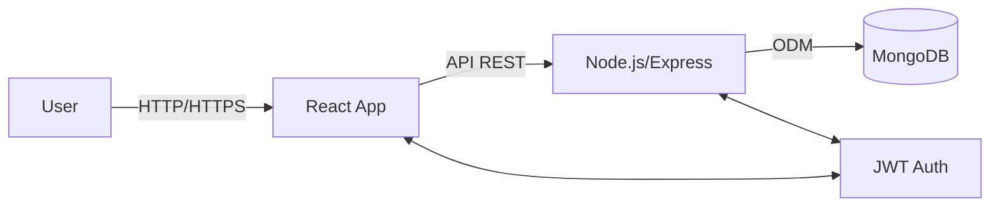
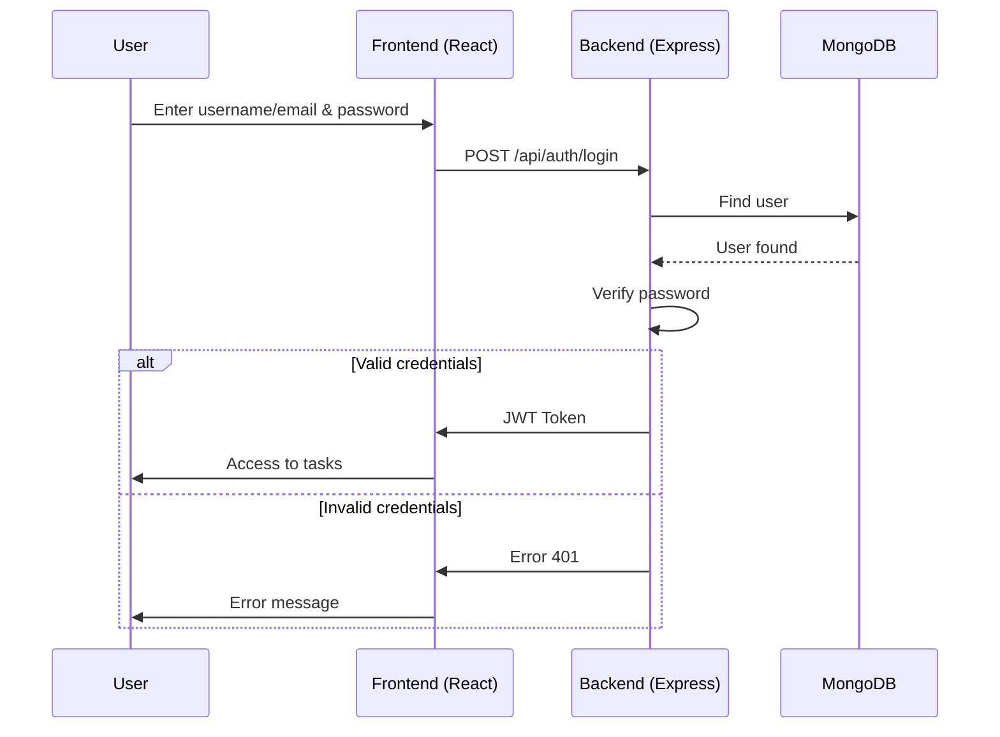
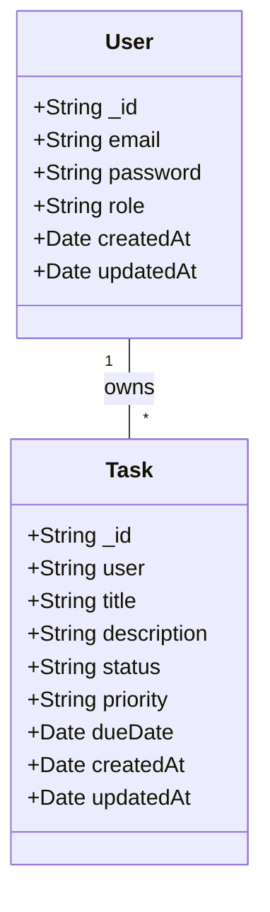
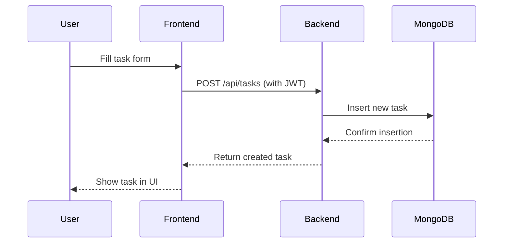

# Wiki: task-manager-fullstack

Welcome to the **task-manager-fullstack** wiki! Here you will find in-depth documentation, diagrams, and guides to help you understand, use, and contribute to the project.

---

## 1. Project Overview
A professional full-stack web application for secure and efficient task management. Built with Node.js, Express, MongoDB, React, and TypeScript, following best security and architectural practices.

---

## 2. Diagrams

### General Architecture


### Authentication Flow


### Data Model (Class Diagram)


### Task Creation Flow


---

## 3. API Endpoints (Detailed)

| Method | Endpoint           | Description                    | Protected |
|--------|--------------------|-------------------------------|-----------|
| POST   | /api/auth/register | Register new user             | No        |
| POST   | /api/auth/login    | User login                    | No        |
| GET    | /api/tasks         | Get all tasks (user)          | Yes       |
| POST   | /api/tasks         | Create new task               | Yes       |
| PUT    | /api/tasks/:id     | Update task                   | Yes       |
| DELETE | /api/tasks/:id     | Delete task                   | Yes       |
| GET    | /api/users/me      | Get current user profile      | Yes       |

---

## 4. Project Structure (Detailed)
```
task-manager-fullstack/
├── backend/
│   ├── src/
│   │   ├── config/
│   │   ├── controllers/
│   │   ├── middlewares/
│   │   ├── models/
│   │   ├── routes/
│   │   ├── services/
│   │   └── utils/
│   ├── .env.example
│   ├── package.json
│   └── ...
├── frontend/
│   ├── src/
│   │   ├── components/
│   │   ├── hooks/
│   │   ├── pages/
│   │   ├── services/
│   │   └── utils/
│   ├── public/
│   ├── package.json
│   └── ...
├── checklist.md
└── README.md
```

- **backend/src/controllers:** Endpoint logic
- **backend/src/services:** Business logic
- **backend/src/models:** Data models
- **backend/src/middlewares:** Auth, validation, error handling
- **frontend/src/pages:** Main views
- **frontend/src/components:** Reusable components
- **frontend/src/services:** API calls
- **frontend/src/hooks:** Custom hooks
- **frontend/src/utils:** Utilities

---

## 5. Environment Variables & Security

- Never commit real `.env` files. Use `backend/.env.example` as a template.
- For production, set strong values for:
  - `JWT_SECRET_PROD`: Long, random string (32+ chars)
  - `MONGO_URI_PROD`: Dedicated MongoDB Atlas URI
  - `FRONTEND_URL`: Your deployed frontend domain
  - `NODE_ENV`: Always `production` in production
- Store secrets in a secure vault (AWS Secrets Manager, Azure Key Vault, etc.)
- Rotate secrets regularly and restrict access.

---

## 6. Agile Methodology

- Project managed with a backlog of user stories and technical tasks.
- Iterative development, focusing on delivering value and code quality.
- Issues and pull requests are tracked for transparency and collaboration.

---

## 7. What I Learned / Skills Demonstrated

- Fullstack development with Node.js, React, TypeScript
- Secure authentication and authorization (JWT, bcrypt)
- Clean code, modular architecture
- RESTful API design
- Responsive UI/UX
- Agile workflow and documentation

---

## 8. Contribution Guide

- Fork the repo, create a branch, submit a pull request.
- For bugs or features, open an issue.
- See [How to Contribute](../README.md#how-to-contribute) in the main README for quick steps.

---

## 9. Contact

- [LinkedIn](https://www.linkedin.com/in/tomasposada)
- [Email](mailto:tomasposada67@gmail.com)

---


---

## 11. API Usage Examples

### Register User
Request:
```http
POST /api/auth/register
Content-Type: application/json
{
  "email": "user@example.com",
  "password": "StrongPassword123"
}
```
Response:
```json
{
  "message": "User registered successfully"
}
```

### Login
Request:
```http
POST /api/auth/login
Content-Type: application/json
{
  "email": "user@example.com",
  "password": "StrongPassword123"
}
```
Response:
```json
{
  "token": "<jwt-token>"
}
```

### Create Task
Request:
```http
POST /api/tasks
Authorization: Bearer <jwt-token>
Content-Type: application/json
{
  "title": "My Task",
  "description": "Details...",
  "priority": "high"
}
```
Response:
```json
{
  "_id": "...",
  "title": "My Task",
  ...
}
```

---

## 12. Troubleshooting

- **Error: Cannot connect to MongoDB**
  - Verifica la URI en `.env` y la conexión a internet.
- **JWT invalid or expired**
  - Asegúrate de enviar el token correcto y que no haya expirado.
- **CORS error**
  - Revisa la configuración de CORS en el backend y el origen permitido.
- **Frontend no arranca**
  - Ejecuta `npm install` y revisa la consola por errores de dependencias.

---

## 13. FAQ

**¿Puedo usar la API desde una app móvil?**
Sí, siempre que manejes el JWT y CORS correctamente.

**¿Cómo restablezco mi contraseña?**
Actualmente no hay endpoint de recuperación, pero puedes implementarlo fácilmente siguiendo la arquitectura.

**¿Puedo desplegar en cualquier proveedor?**
Sí, el stack es compatible con la mayoría de servicios (Vercel, Heroku, Render, etc.).

**¿El proyecto es seguro para producción?**
Sí, siguiendo las recomendaciones de variables de entorno y buenas prácticas.

---

## 10. License

MIT License. See [LICENSE](../LICENSE).
